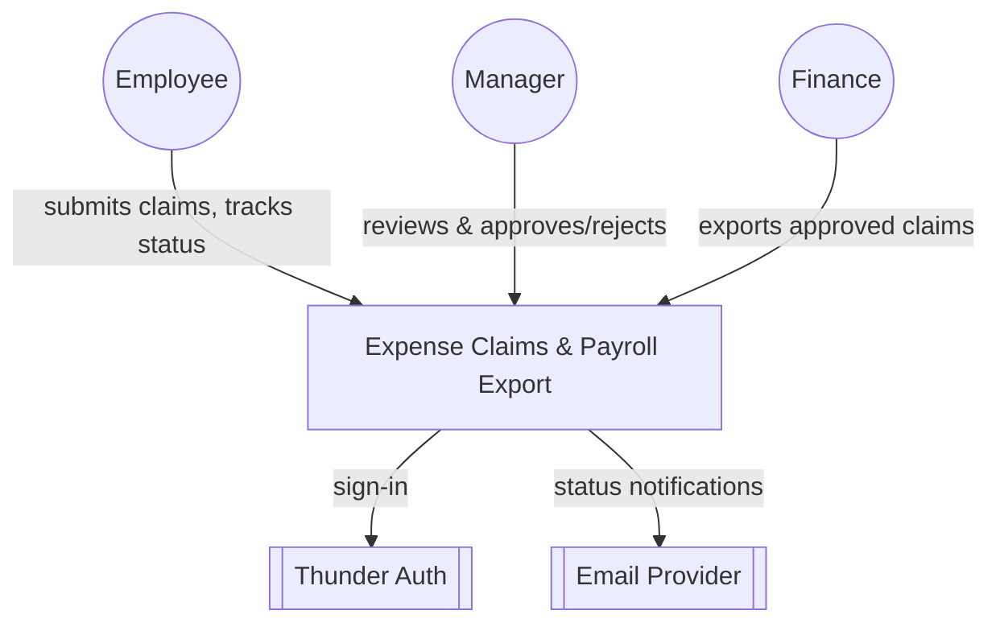
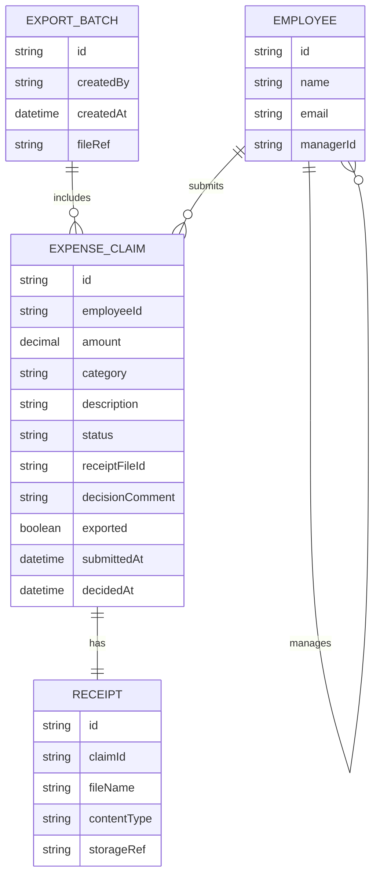
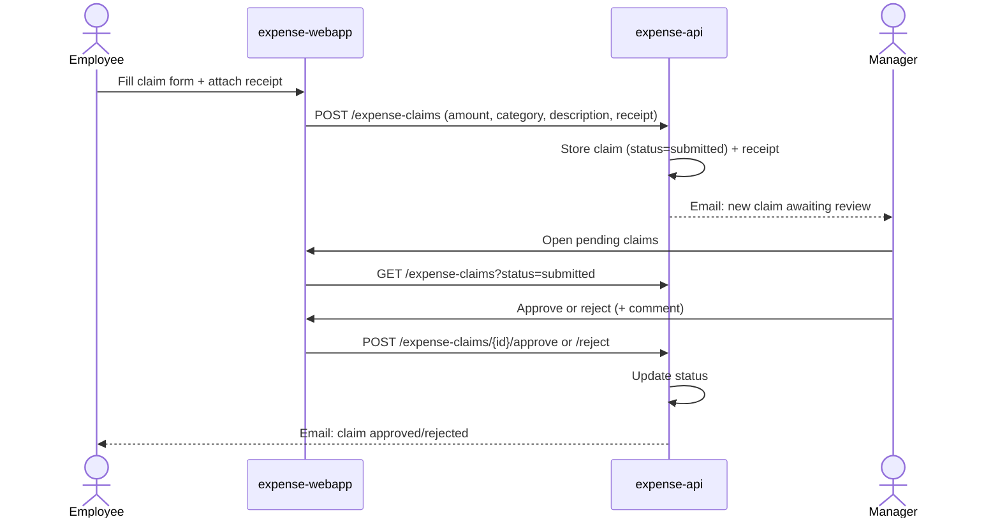
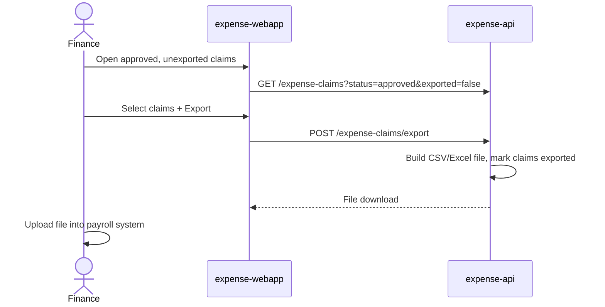

# Expense Claims &amp; Payroll Export — Design

## Overview

The system is a single React SPA (`expense-webapp`) fronting one Ballerina API
(`expense-api`) that owns the full expense-claim lifecycle: employees submit
claims with a required receipt, managers approve or reject the claims their
reports submit, and finance reviews approved-but-unexported claims and
downloads a CSV/Excel export to hand to payroll. `expense-api` persists claims
in a Postgres database, stores receipt files in an object store, sends
transactional email notifications on submission and decision, and both the
SPA and the API authenticate signed-in users through Thunder, the platform
IDP. There is no live payroll integration — export is a file the finance
actor manually uploads elsewhere.

## Context (C1)

## Domain model (ER)

## Key flows

### Submit and approve a claim

### Finance export to payroll

